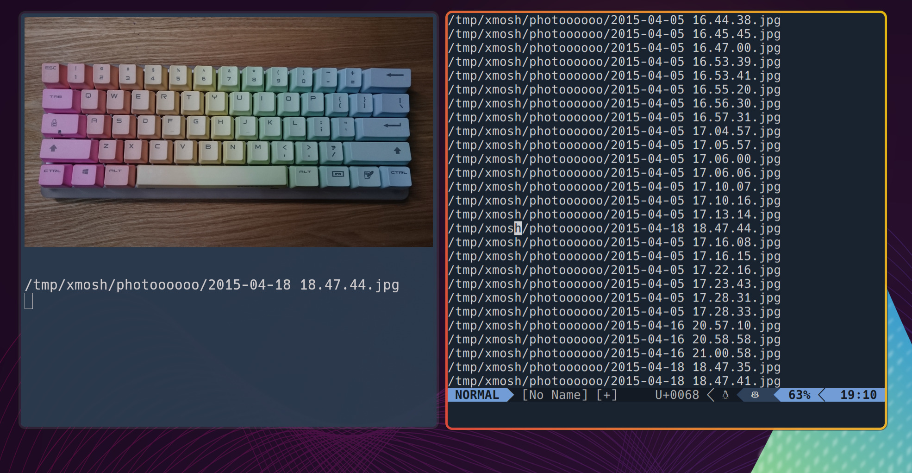

# Preview on Console

A Neovim plugin that automatically previews images, PDFs, and SVG files in your terminal when your cursor hovers over file paths.



## Features

- **Real-time preview**: Automatically displays images when cursor moves over file paths
- **Multiple formats**: Supports JPG, JPEG, PNG, GIF, BMP, WEBP, SVG, and PDF files
- **Intelligent caching**: Caches converted files for faster subsequent previews
- **Debounced updates**: Prevents excessive preview updates during rapid cursor movement
- **Toggle functionality**: Enable/disable preview functionality on demand
- **Liname support**: Special support for tab-separated line number and file path format

## Requirements

- **Neovim** (any recent version)
- **Kitty terminal** - Required for image display using `kitty icat`
- **pdftoppm** (from poppler-utils) - For PDF preview
- **rsvg-convert** (from librsvg) - For SVG preview

### Installation of Dependencies

```bash
# Ubuntu/Debian
sudo apt install poppler-utils librsvg2-bin

# Arch Linux
sudo pacman -S poppler librsvg

# macOS
brew install poppler librsvg
```

## Installation

### Using lazy.nvim

```lua
{
  "your-username/preview-on-console",
  config = function()
    require('preview-on-console').setup()
  end
}
```

### Using packer.nvim

```lua
use {
  'your-username/preview-on-console',
  config = function()
    require('preview-on-console').setup()
  end
}
```

### Manual Installation

1. Clone the repository to your Neovim plugin directory:
   ```bash
   git clone https://github.com/your-username/preview-on-console.git ~/.local/share/nvim/site/pack/plugins/start/preview-on-console
   ```

2. Add to your `init.lua`:
   ```lua
   require('preview-on-console').setup()
   ```

## Usage

### Basic Usage

1. **Start the preview daemon** in a separate terminal:
   ```bash
   ./preview-on-console
   ```

2. **Enable preview** in Neovim:
   ```
   :POCEnable
   ```

3. **Move your cursor** over any file path in your buffer - the file will automatically preview in the terminal running the daemon.

### Commands

- `:POCEnable` - Enable preview functionality
- `:POCDisable` - Disable preview functionality  
- `:POCToggle` - Toggle preview functionality on/off
- `:POCLinameEnable` - Enable special liname mode for tab-separated line:path format

### Liname Mode

For files with tab-separated format like:
```
123	/path/to/image.jpg
456	/path/to/document.pdf
```

Use `:POCLinameEnable` to build a cache that maps line numbers to file paths for faster lookups.

## How It Works

1. The plugin monitors cursor movement in Neovim
2. When cursor moves over a file path, it extracts the path and sends it via FIFO to the daemon
3. The daemon receives the path and displays the appropriate preview:
   - **Images**: Direct display using `kitty icat`
   - **PDFs**: Converted to PNG using `pdftoppm`, then cached and displayed
   - **SVGs**: Converted to PNG using `rsvg-convert`, then cached and displayed
4. Converted files are cached in `/tmp/preview_on_console_cache` for performance

## Configuration

The plugin works out of the box with minimal configuration. The main setup call is:

```lua
require('preview-on-console').setup()
```

## Supported File Types

| Format | Extensions | Requirements |
|--------|------------|--------------|
| Images | jpg, jpeg, png, gif, bmp, webp | Kitty terminal |
| PDF | pdf | pdftoppm, Kitty terminal |
| SVG | svg | rsvg-convert, Kitty terminal |

## Troubleshooting

### Preview not working

1. **Check if Kitty terminal is installed**: `which kitty`
2. **Verify dependencies**: `which pdftoppm rsvg-convert`
3. **Ensure daemon is running**: The `preview-on-console` script should be running in a separate terminal
4. **Check FIFO permissions**: The plugin creates `/tmp/preview_on_console_fifo` - ensure it has proper permissions

### Performance issues

- The plugin includes debouncing (200ms) to prevent excessive updates
- Converted files are cached to avoid repeated conversions
- Cache directory: `/tmp/preview_on_console_cache`

## License

MIT License

## Contributing

Feel free to submit pull requests with improvements, bug fixes, or new features!